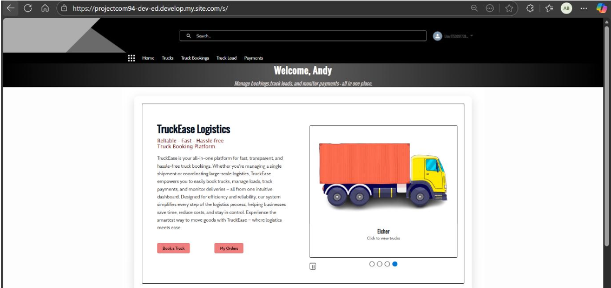
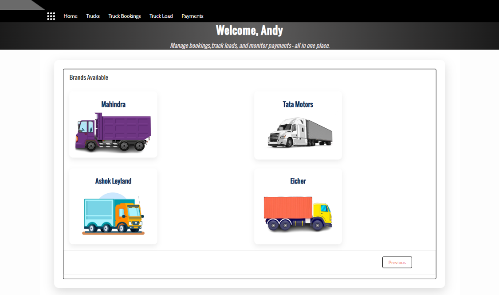
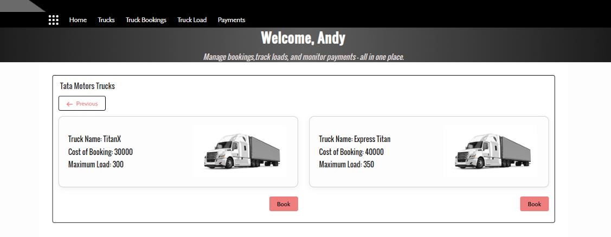
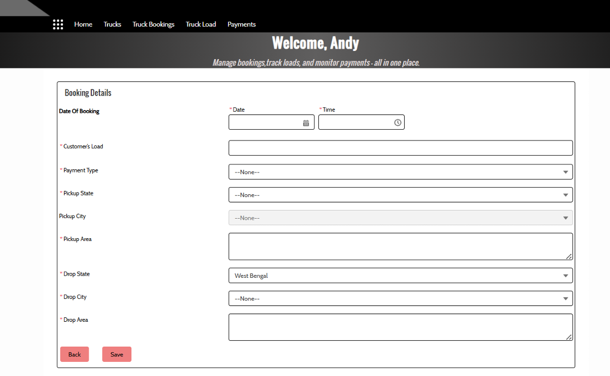
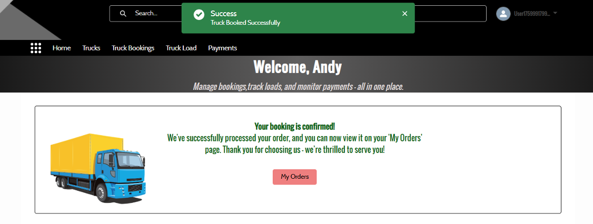
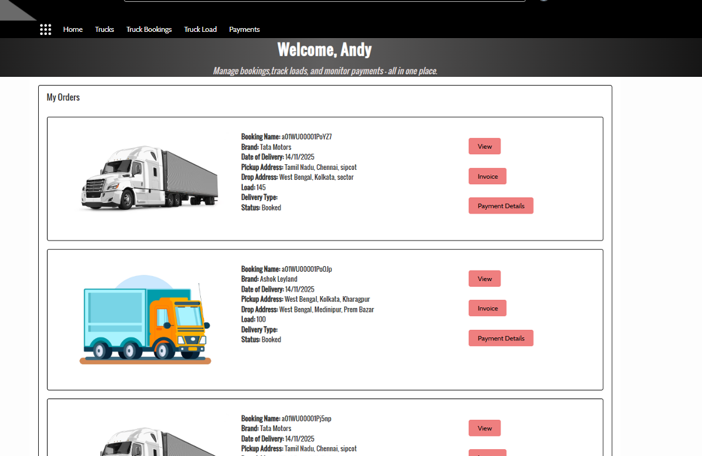

# 🚚 Truck Booking Management System (Salesforce)

---

## 📌 Project Summary

A **real-world Salesforce Experience Cloud application** that enables customers to **browse trucks, book logistics services, track orders, and manage payments** through a secure self-service portal.

This project demonstrates **both Salesforce Admin and Developer capabilities**, built using **Lightning Web Components, Apex, SOQL, Flows, Validation Rules, Reports, and Dashboards**, closely simulating a **production-grade logistics booking system**.

From a **Salesforce Admin perspective**, the project includes:
- **Data security implementation** using Profiles, Permission Sets, Object & Field-Level Security  
- **Validation Rules** to enforce business constraints (load limits, mandatory booking details, payment checks)  
- **Record-triggered and Screen Flows** for automation and guided user processes  
- **Custom Reports and Dashboards** for tracking bookings, deliveries, and payment status  

From a **Salesforce Developer perspective**, the project showcases:
- **Lightning Web Components (LWC)** for responsive, component-based UI  
- **Apex controllers** for business logic and data retrieval  
- **Optimized SOQL queries** with user-context security  
- **Experience Cloud integration** for customer-facing functionality  

Overall, this project reflects **end-to-end Salesforce CRM development**, covering **data modeling, security, automation, UI, and analytics** in a single integrated solution.

---

## 🎯 Business Use Case

Logistics companies require a **self-service customer portal** where users can:
- Browse trucks by brand and load capacity  
- Book trucks with pickup and drop locations  
- Track booking status  
- View invoices and payment details  

This application solves the above using **Salesforce CRM + Experience Cloud**.

---

## 🏗️ Tech Stack Used

| Layer | Technology |
|-----|-----------|
| UI | Lightning Web Components (LWC) |
| Backend | Apex Classes, SOQL |
| Platform | Salesforce Experience Cloud |
| Data | Custom Objects (Truck, Truck Booking, Load, Payment) |
| Metadata | Salesforce DX (SFDX) |
| Navigation | NavigationMixin, UIRecordApi |

---

## 📸 Application Screenshots

### 🏠 Home / Landing Page

---

### 🚚 Truck Brand Selection

---

### 📋 Truck Listing by Brand

---

### 📝 Truck Booking Form

---

### ✅ Booking Confirmation

---

### 📦 My Orders Dashboard

`

---

## ⚙️ Key Features

### 🔹 Truck Browsing & Selection
- Brand-based truck browsing
- Dynamic data fetched using Apex + SOQL
- Clean, responsive LWC UI

### 🔹 Booking Management
- Step-by-step booking process
- Load validation against truck capacity
- Date, time, and address validations

### 🔹 Customer Orders Dashboard
- Logged-in user specific data
- Booking status, invoice, and payment tracking
- Secure Experience Cloud access

### 🔹 Backend Architecture
- Bulk-safe Apex controllers
- Optimized SOQL queries
- Clear separation of UI and business logic

---

## 🧩 Core Components

### 🟦 Apex Classes
| Class | Responsibility |
|-----|----------------|
| `TruckController.cls` | Fetch trucks by brand and availability |
| `MyOrder.cls` | Retrieve logged-in user’s bookings |

---

### 🟩 Lightning Web Components
| Component | Purpose |
|---------|--------|
| `home1` | Landing page and brand selection |
| `booking1` | Complete truck booking flow |
| `myOrder` | Customer order dashboard |

---

## 🧠 What This Project Demonstrates

✔ Hands-on Experience Cloud development  
✔ Strong LWC and Apex integration  
✔ Real-world Salesforce data modeling  
✔ Secure, user-specific data handling  
✔ End-to-end Salesforce project ownership  

---

## 🧑‍💻 Author

**Aninda Banerjee**  
_Salesforce Developer @ Cognizant (CTS)_  
📍 India  
🔗 LinkedIn → [Aninda Banerjee](https://www.linkedin.com/in/anindabanerjee18)

---

## ⭐ If you like this project, give it a star!
